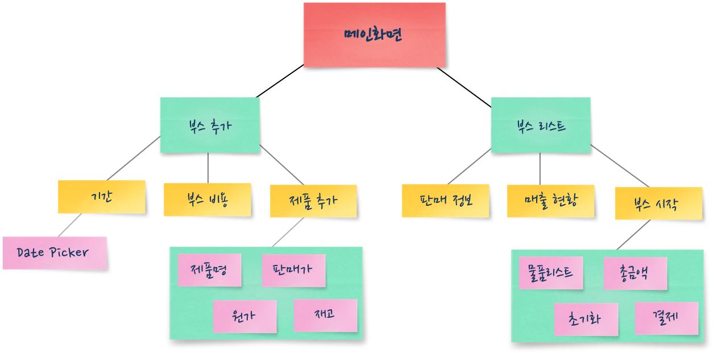
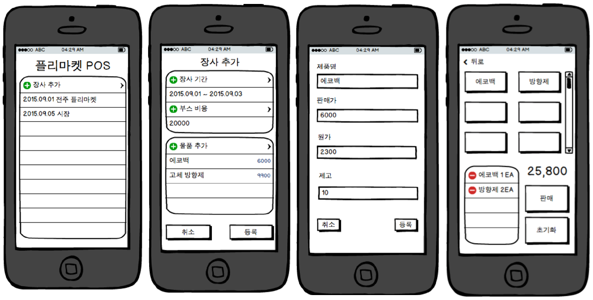
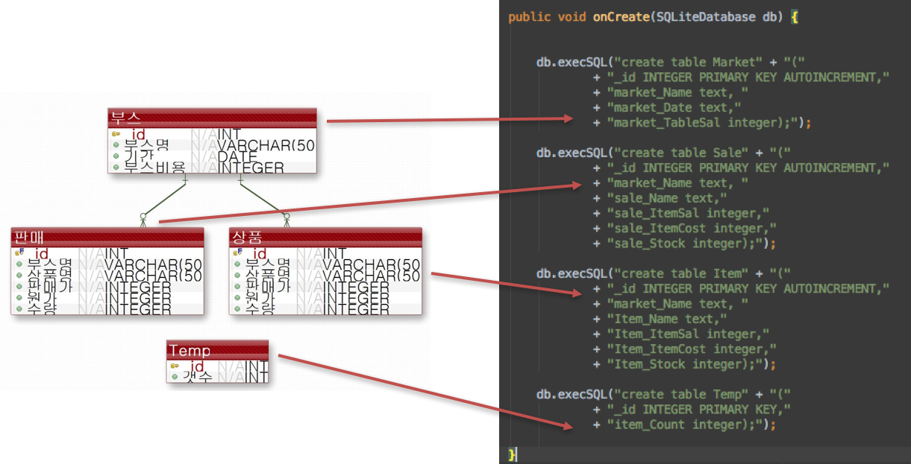
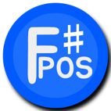
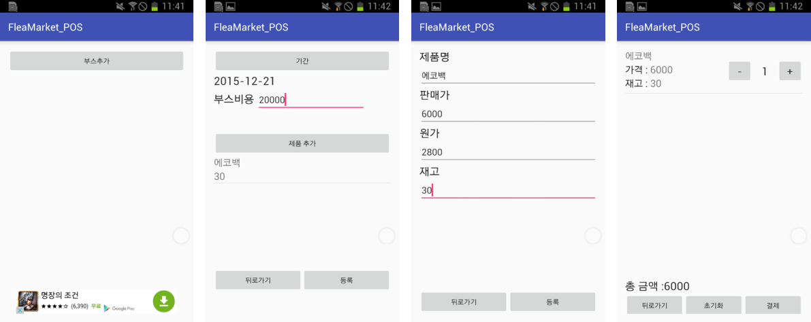

# FleaMarket POS
+ 본저장소는 개인 안드로이드 앱 개발 프로젝트를 위한 저장소입니다.

## 프로젝트 개요

### 프로젝트 기간
+ 2015.09 ~ 2015. 12 (3개월)

### 담당업무
+ 계획, 설계, DB 설계, 구현

### Tools & Language
+ Android Studio, Balsamiq Mockups(UI), eXERD(ERD), SQLite(DBMS)
+ Java, SQL

### 목적
+ 개인 매장을 운영하지 않는 길거리 혹은 부스에서 물품 판매 시 정산의 편의성 제공

## 구현

### 기능
+ 당일 부스 생성과 판매 물품 등록 - 실시간 판매
+ 하루 총 수입 정산
+ 기간별 수입 정산
+ Data Export
+ 구글 애드몹 광고

- 시스템 요구사항 구조화

- 사용자 인터페이스 설계

- Database 설계

- 앱 로고 및 구현

